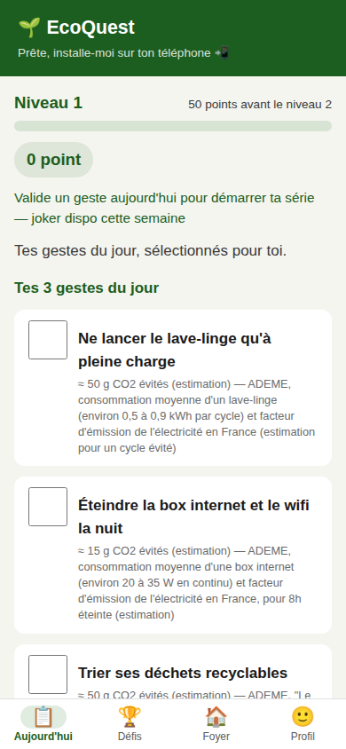

# 🌱 EcoQuest

**Chaque geste compte, et en famille ça se voit.**

EcoQuest est une application mobile (PWA) qui gamifie les éco-gestes du quotidien à l'échelle du foyer : chaque jour, l'app propose 3 petits gestes concrets, suit les points, niveaux, séries et badges de la famille, et cumule un impact CO2 estimé — sourcé (ADEME / Impact CO2) et toujours affiché comme une estimation.

Le rappel quotidien est le cœur du produit : ce qui fait revenir, c'est la notification du jour, pas la taille du catalogue.

## Capture



## Stack

| Couche | Choix |
| --- | --- |
| Front | HTML / CSS / JS vanilla, modules ES — **aucun bundler, aucun build** |
| Données | `localStorage` (migration douce à chaque nouvelle propriété), export/import JSON manuel |
| PWA | `manifest.webmanifest` + `sw.js` (service worker, app shell précaché) |
| Tests | `node --test`, aucune dépendance npm |
| CI | GitHub Actions (`.github/workflows/tests.yml`) |
| Coquille mobile (à venir) | Capacitor (Android), notifications locales, Supabase, distribution Google Play |

Le détail des choix et des contraintes de conception est dans [`CLAUDE.md`](CLAUDE.md). L'avancement du projet se suit dans [`ROADMAP.md`](ROADMAP.md).

## Lancer l'app en local

Le service worker exige d'être servi en HTTP (pas de double-clic sur `index.html`). N'importe quel serveur statique fait l'affaire, par exemple :

```bash
python3 -m http.server 8000
```

puis ouvrir `http://localhost:8000` dans un navigateur (idéalement en vue mobile, 360–430 px de large).

## Lancer les tests

Aucune installation nécessaire (pas de `npm install`) :

```bash
node --test tests/*.test.js
```

Ces mêmes tests tournent automatiquement à chaque push et pull request via GitHub Actions.

## Licence

Distribué sous licence MIT — voir [`LICENSE`](LICENSE).
